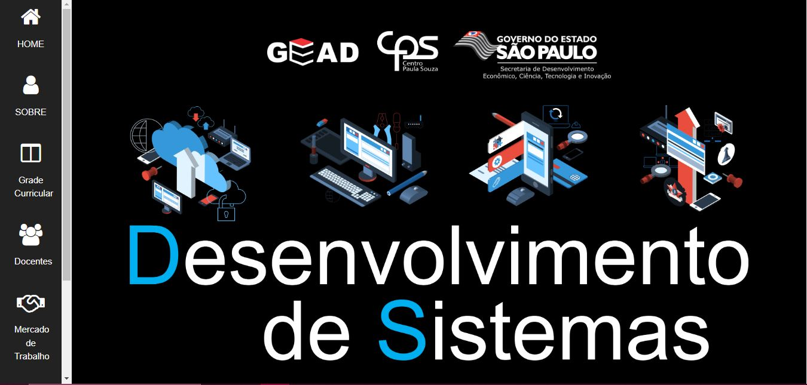

# projeto-frontend-etec
Projeto Front End criado para uma atividade do *curso técnico em Desenvolvimento de Sistemas* da Escola Técnica Estadual de São Paulo. 
O projeto é uma landing page simples e dinâmica, que contém informações sobre o curso de Desenvolvimento de Sistemas, e utiliza as tecnologias: **HTML**, **CSS** e o framwork **W3.CSS**.

Você pode acessar o projeto por este link: https://nathyalves.github.io/projeto-frontend-etec/

